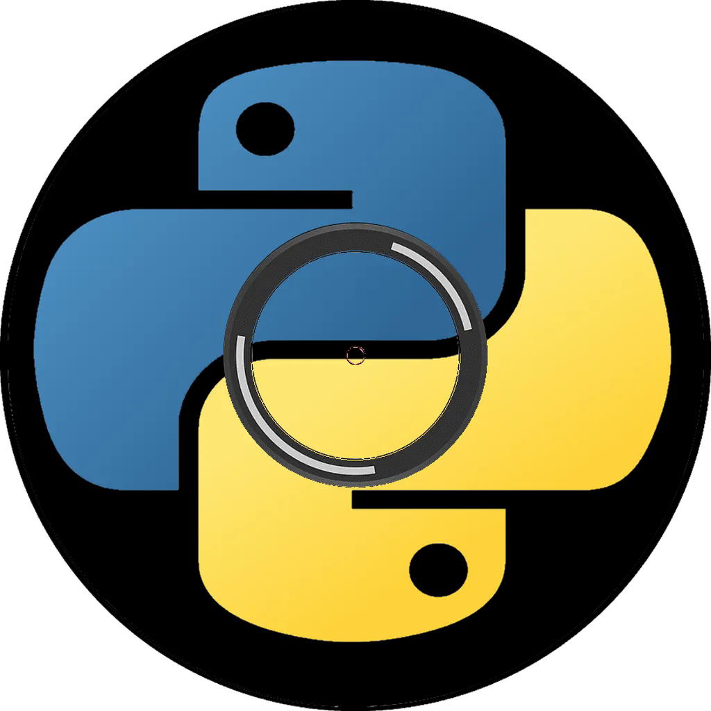

# 🎶 PYMusicBot
A music bot designed to be robust (by using FFmpeg) and to be hosted on one Discord server only 
This code base is based on the [self-bot version](https://github.com/vlOd2/SelfMusicBot)

# 📌 Features
- Robust (because it can only be hosted on one Discord server only)
- Uses FFmpeg so it can play basically any file format with any codec

# 🔧 How to setup
Check the wiki page [here](https://github.com/vlOd2/PYMusicBot/wiki/Setup) for a guide on setup

# 👨‍💻 Contributing
You may proceed with the following steps if you wish to contribute to this project

1. Fork or clone this repository
2. Make your changes
3. Commit & push your changes
4. Submit a pull request here

# ⚖ License
This project is licensed under the GPLv3 license
 
You may refer to the "LICENSE" file for more information
